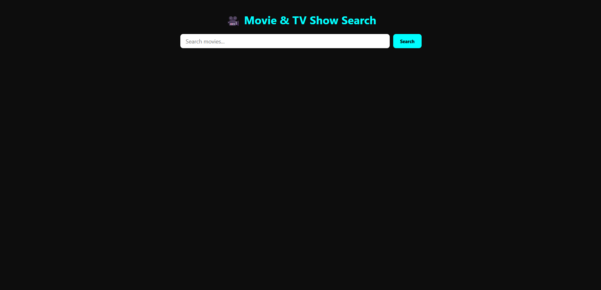
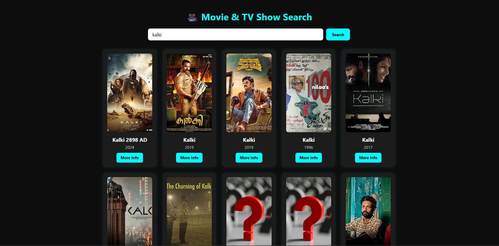
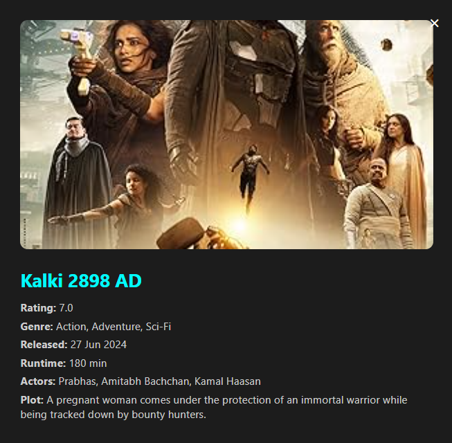

# 🎬 MovieInfo — Movie Search & Discovery


**MovieInfo** is a browser-based movie search application built with **HTML, CSS, and vanilla JavaScript**.

It uses the **OMDb API** to search for movies and dynamically displays movie posters, titles, release years, ratings, genres, runtime, cast information, release dates, and full plot descriptions.

The application provides a simple, responsive interface for quickly discovering movie information without requiring a complex frontend framework.

---

# 📑 Table of Contents

- Features
- Screenshots
- Live Demo
- Technologies
- Project Structure
- How It Works
- Movie Search
- Movie Details
- API Integration
- Installation
- Security Note
- Future Improvements
- Contributing
- License
- Author
- Support

---

# ✨ Features

✅ Movie Search

✅ OMDb API Integration

✅ Real-Time API Requests

✅ Movie Poster Display

✅ Movie Title Display

✅ Release Year Display

✅ IMDb Rating

✅ Genre Information

✅ Release Date

✅ Runtime Information

✅ Cast Information

✅ Full Plot Description

✅ Detailed Movie Modal

✅ Responsive Movie Card Grid

✅ Hover Animations

✅ Search Button

✅ Enter-Key Search

✅ Missing Poster Fallback

✅ Error Handling

✅ Dark Movie-Themed Interface

✅ Pure Vanilla JavaScript

---

# 📸 Screenshots

## 🏠 Movie Search

<p align="center">

</p>

---

## 🎬 Search Results

<p align="center">

</p>

---

## ℹ️ Movie Details

<p align="center">

</p>

---

## 📱 Mobile View

<p align="center">

</p>

---

# 🚀 Live Demo

https://dhruvpandit46.github.io/MovieInfo/

---

# ⚙ Technologies Used

- HTML5
- CSS3
- JavaScript (ES6)
- OMDb API
- Fetch API
- REST API
- DOM Manipulation
- CSS Grid
- Responsive Design
- Browser APIs

---

# 📂 Project Structure

```text
MovieInfo/
│
├── index.html
├── style.css
├── script.js
├── assets/
│   └── default.jpg
├── images/
└── README.md
```

---

# ⚡ How It Works

MovieInfo follows a simple client-side API workflow:

```text
User
 │
 ▼
Search Movie
 │
 ▼
JavaScript
 │
 ▼
OMDb API
 │
 ▼
Movie Search Results
 │
 ▼
Movie Cards
 │
 ├── Poster
 ├── Title
 ├── Release Year
 └── More Info
       │
       ▼
   Full Movie Details
       │
       ▼
     Modal
```

---

# 🔎 Movie Search

Users can enter a movie name into the search field.

The application sends a request to the OMDb API using the search endpoint:

```text
https://www.omdbapi.com/?apikey=API_KEY&s=MOVIE_NAME
```

The returned results are dynamically converted into movie cards.

Each card contains:

- Movie poster
- Movie title
- Release year
- More Info button

---

# 🎬 Movie Details

Selecting **More Info** sends another API request using the movie's IMDb ID.

```text
https://www.omdbapi.com/?apikey=API_KEY&i=IMDB_ID&plot=full
```

The application then displays detailed information inside a modal.

### Details displayed

- 🎬 Title
- ⭐ IMDb Rating
- 🎭 Genre
- 📅 Release Date
- ⏱ Runtime
- 👥 Actors
- 📖 Full Plot
- 🖼 Movie Poster

---

# 🖼 Movie Cards

Search results are dynamically generated using JavaScript.

Each result becomes a `.movie-card` containing:

```text
Movie Card
│
├── Poster
├── Title
├── Release Year
└── More Info
```

The layout uses CSS Grid to automatically adapt the number of cards displayed according to the available screen width.

---

# 🔌 OMDb API Integration

MovieInfo uses the **OMDb API** as its external movie data source.

The application performs two primary API operations:

### Search

```javascript
?s=${encodeURIComponent(query)}
```

### Detailed Information

```javascript
&i=${imdbID}&plot=full
```

The Fetch API is used to asynchronously retrieve the JSON responses.

---

# ⚠️ Error Handling

The application handles several common API and user-input situations.

### Empty Search

The application does not send a request when the search field is empty.

### No Results

If the API does not return matching movies, the application displays:

```text
No results found for "query".
```

### API / Network Error

If the request fails, the application displays an error message instead of leaving the interface blank.

### Missing Poster

When OMDb returns:

```text
Poster: N/A
```

the application falls back to:

```text
assets/default.jpg
```

---

# 🎨 UI Highlights

- Dark cinematic interface
- Cyan accent color
- Responsive movie grid
- Movie poster cards
- Hover scaling animations
- Detailed information modal
- Modal background overlay
- Clean search interface
- Responsive layout
- Minimal frontend architecture

---

# 📦 Installation

Clone the repository:

```bash
git clone https://github.com/dhruvpandit46/MovieInfo.git
```

Go inside the project:

```bash
cd MovieInfo
```

Open:

```text
index.html
```

in a browser.

No framework or package installation is required.

---

# 🔑 API Configuration

MovieInfo requires an **OMDb API key** to retrieve movie information.

The current implementation stores the API key inside `script.js`:

```javascript
const API_KEY = "YOUR_API_KEY";
```

Replace it with your own OMDb API key if necessary.

> **Security Note:** API keys embedded in frontend JavaScript are visible to anyone who can inspect the website. For a production application, API requests should be routed through a backend service or serverless function.

---

# 🎯 Future Improvements

- Movie pagination
- Search suggestions
- Genre filtering
- Year filtering
- IMDb rating filtering
- Trending movies
- Popular movies section
- Movie favorites
- Watchlist
- LocalStorage support
- Search history
- Dark / light theme
- Skeleton loading animations
- Advanced movie sorting
- Actor information
- Related movies
- Trailer integration
- TMDB integration
- Backend API proxy
- Secure API key handling
- PWA support

---

# 🤝 Contributing

Contributions are welcome.

1. Fork the repository.

2. Create your feature branch:

```bash
git checkout -b feature/new-feature
```

3. Commit your changes:

```bash
git commit -m "Add new feature"
```

4. Push your branch:

```bash
git push origin feature/new-feature
```

5. Open a Pull Request.

---

# 📜 License

Licensed under the **MIT License**.

MIT © 2026 Dhruv Pandit.

See the [LICENSE](LICENSE) file for full license details.

---

# 👨‍💻 Author

**Dhruv Pandit**

GitHub

https://github.com/dhruvpandit46

LinkedIn

https://www.linkedin.com/in/dhruv-pandit-755786326

Instagram

https://instagram.com/dhruv_pandit2007

---

# ⭐ Support

If you found **MovieInfo** useful,

please consider giving it a ⭐ on GitHub.

It helps support future development.
